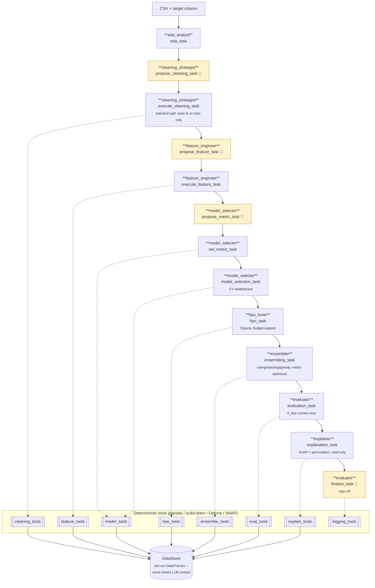

# DS-Crew

[](https://github.com/rushikeshdhumal/ml-agent-structured-data/actions/workflows/ci.yml)
[](LICENSE)
[](pyproject.toml)
[](https://ai.azure.com)

**Letting an autonomous agent near real data is a governance problem before it
is a modeling problem.** The hard question is not whether an LLM can pick a good
model -- it usually can. It is whether you can prove what it did, stop it before
it does something irreversible, and explain the result to whoever is accountable
for the decision.

DS-Crew is one answer. Eight agents, hosted as [Azure AI
Foundry](https://ai.azure.com) agents, run the full data-science lifecycle for
structured (tabular) data -- EDA, cleaning, feature engineering, model
selection, hyperparameter optimization, ensembling, evaluation, and
explainability -- where **agents never touch the data**. Every mutation goes
through a deterministic, Pydantic-validated Python tool; every irreversible
decision is gated on a human; every step is driven by an explicit,
code-defined pipeline order rather than an LLM-routed handoff.

Raw data acquisition is explicitly out of scope: you hand it a CSV and a
target column, and it takes it from there.

> This branch hosts the agents entirely in Azure AI Foundry, driven by an
> external, code-defined workflow (`ds_crew.maf`, built on [Microsoft Agent
> Framework](https://github.com/microsoft/agent-framework)) rather than
> Foundry's own visual Workflow UI, which retires 2026-12-01 with Microsoft's
> own guidance pointing here instead. An earlier, self-contained CrewAI
> implementation (agents and orchestration both running in-process, no Azure
> account required) lives on `main`; see
> ["Why orchestration lives here and not in Foundry"](#why-orchestration-lives-here-and-not-in-foundry)
> for why the two don't share one dependency tree.

## Quick start

Requires [uv](https://docs.astral.sh/uv/), an Azure subscription with an AI
Foundry project, and the [Azure CLI](https://learn.microsoft.com/cli/azure/)
for `az login`.

```bash
git clone https://github.com/rushikeshdhumal/ml-agent-structured-data.git
cd ml-agent-structured-data
uv sync --extra dev --extra service --extra maf --extra foundry
cp .env.example .env   # set AZURE_FOUNDRY_PROJECT_ENDPOINT, SERVICE_API_KEY, SERVICE_PUBLIC_URL
az login               # Entra auth; the Agents API takes no API key
```

Both `--extra maf` and `--extra foundry` are needed together: `agent-framework-foundry`
(the `maf` extra) pulls its own compatible `azure-ai-projects`, but not
`azure-identity`, which `ds_crew.maf`'s `DefaultAzureCredential` needs directly.
Add `--extra observability` too if you want traces exported to Application
Insights (see ["Observability"](#observability)), and `--extra evaluation`
for `--evaluate`'s Azure AI Evaluation SDK evaluators (see
["Automated quality evaluation"](#automated-quality-evaluation)) -- both are
optional, everything above runs without either.

Create the eight agents in the Foundry portal once (see "Running on Azure AI
Foundry" below), then start the tool layer and drive a run:

```bash
uv run ds-crew-service --port 8000          # terminal 1: the tool layer
uv run ds-crew-maf \
  --csv path/to/data.csv --target target_column
```

By default the run pauses at the tool-service's four gated tools (cleaning,
feature engineering, the optimization metric, and the final sign-off) plus a
live prompt to review the explanation before deciding on the model; pass
`--auto-approve` for an unattended run (recorded as a rejection unless you
also pass `--verdict`). Every run is checkpointed at each stage boundary, so a
crash can be resumed with `--resume <checkpoint-id>` rather than starting over
(`--list-checkpoints` shows what's available) -- see
["Running on Azure AI Foundry"](#running-on-azure-ai-foundry) for what that
looks like.

Run the tests:

```bash
uv run pytest
```

## Preparing a dataset

Any CSV with a target column works, but to exercise every stage pick one with
missing values (cleaning does real work), mixed numeric/categorical columns
(feature engineering does real work), and mild class imbalance (the metric
gate faces a genuine decision). Columns a reader already understands help
most of all -- they make the explainability output checkable against
intuition rather than taken on trust.

Drop free-text and ID-like columns first (`Name`, `Ticket`, `PassengerId`,
...). The feature-plan schema requires *every* non-target column to be
explicitly encoded or dropped, so leaving high-cardinality text in mostly
buys retries.

See ["Running on Azure AI Foundry"](#running-on-azure-ai-foundry) below for
the actual run walkthrough -- gate-by-gate and what to expect.

## Architecture

Eight agents run a fixed thirteen-task pipeline. Every task that touches the
dataset delegates to a deterministic tool -- the agent proposes, code
executes:



👤 = human-in-the-loop gate (paused by `ds_crew.maf`'s workflow on the tool
service's four gated tools)

**Agents never manipulate data directly.** Every mutating action --
profiling, cleaning, encoding, training, tuning, evaluating -- goes through a
Pydantic-validated tool. This is enforced in layers:

1. Pydantic `args_schema` on every tool rejects structurally invalid
   arguments before they reach any logic.
2. Every mutating tool re-validates its input against the *actual current
   dataset* at call time (unknown columns, target-as-feature, disallowed
   strategies all come back as a structured error, never a silent no-op) --
   this is the real trust boundary, not any upstream check.
3. Hyperparameter search budgets (`n_trials`, `timeout_s`) are hard-capped in
   code (`settings.MAX_HPO_TRIALS` / `MAX_HPO_TIMEOUT_S`), regardless of what
   an agent requests.

**Human-in-the-loop.** `apply_cleaning_plan` (which also performs the
train/test split), `apply_feature_plan`, `set_evaluation_metric`, and
`finalize_run` are MCP tools with `require_approval: always`: an agent
proposes a call, Foundry pauses it, and `ds_crew.maf`'s workflow (built on
Microsoft Agent Framework) shows a human the exact arguments before deciding.
A denial with a reason
sends the agent back to revise that specific proposal, not to abandon the
run -- see ["Running on Azure AI Foundry"](#running-on-azure-ai-foundry) for
what that loop actually looks like live. The final sign-off gate is a
separate turn from `evaluation_task`, deliberately: `finalize_task` only runs
after `explanation_task`, so the human decides with the held-out metrics
*and* the evidence of what the model learned in front of them, rather than
approving on a score and being shown the explanation afterwards.

**No test-set leakage.** The train/test split happens in cleaning, not
feature engineering, specifically so that every cleaning statistic --
imputation values, outlier bounds, KNN-imputer neighbors -- is fit on the
training split only and applied identically to the test split (duplicate-row
dropping is the one exception: it runs pre-split, so an identical row can
never land in both halves). Encoders/scalers/feature-selectors in feature
engineering are fit on the training split the same way. X_test is **scored**
exactly once, in evaluation: no model can be selected, tuned, ensembled, or
compared on held-out performance more than once, so the test score cannot be
optimized against. Explanation reads X_test a second time, but read-only,
strictly after evaluation (`explain_models` refuses to run until scoring is
locked in), and only to inform the terminal human decision -- nothing it
surfaces can flow back into choosing a model.

**Metadata logging** (`tools/logging_tools.py`) is deterministic code, not
an agent -- called directly from inside each mutating tool rather than
depending on an agent remembering to log something. It logs against a local
SQLite-backed MLflow store, no server required; a run's MLflow lifetime is
opened by `POST /runs` and closed by `finalize_run` (see
["Observability"](#observability)). Cost visibility for a Foundry run also
comes from `ds_crew.maf.state.PipelineState.cost_usd()`, printed in the
summary table `ds_crew.maf.host.summarize()` writes at the end of every run --
that figure is LLM token cost, distinct from anything MLflow tracks.

### Model registry

`model_tools.py` cross-validates a fixed, code-defined candidate set chosen
for empirical strength on tabular data rather than breadth:

| Task | Candidates |
|---|---|
| Classification | `logistic_regression`, `knn`, `xgboost`, `lightgbm`, `catboost` |
| Regression | `ridge`, `elastic_net`, `knn`, `xgboost`, `lightgbm`, `catboost` |

The agent never chooses which model classes exist, only which leaderboard
entries move on to HPO (`hpo_tools.py`, Optuna, one fixed search space per
model) and evaluation. A failing candidate is skipped and recorded in
`Leaderboard.warnings` rather than crashing the whole leaderboard.

### Optimization metric

Before model selection, a human-gated `propose_metric_task`/`set_metric_task`
pair (`model_selector` agent) picks the metric that cross-validation, HPO,
ensembling, and evaluation all optimize against -- never hard-coded accuracy.
Allowed metrics (`model_tools.ALLOWED_METRICS`) are bounded, higher-is-better:

| Task | Allowed metrics |
|---|---|
| Classification | `f1_macro` (default), `accuracy`, `precision_macro`, `recall_macro`, `balanced_accuracy`, `roc_auc` |
| Regression | `r2` (default) |

The chosen metric is stored once on `RunState.metric_name` and threaded
through every downstream tool; `Leaderboard.metric_name` is the ground-truth
record of what a run's CV scores actually measure.

### Ensembling

After HPO, `ensemble_tools.py`'s `build_ensemble` (the `ensembler` agent)
combines the strongest leaderboard/HPO candidates (up to
`MAX_ENSEMBLE_MEMBERS`, default 5) into a single model -- soft voting,
weighted voting, greedy (Caruana 2004) selection, and stacking are all
cross-validated against the run's chosen metric, and whichever wins is kept.
Out-of-fold member predictions are computed once and reused across every
strategy, so weight/greedy search is cheap. The result is registered as an
extra `"ensemble"` leaderboard candidate, fit on `X_train` only, so it is
scored by the same single-pass `evaluate_models` call as the tuned single
models -- preserving the "X_test touched exactly once" invariant -- and is
eligible for human sign-off at finalize like any other candidate.

### Explainability

After evaluation and before sign-off, `explain_tools.py`'s `explain_models`
(the `explainer` agent) reports what the evaluated model(s) actually learned:

| Layer | Method | Applies to |
|---|---|---|
| Floor (always) | scikit-learn permutation importance on held-out rows | every model, **including the ensemble** |
| Attribution | SHAP `TreeExplainer` | `xgboost`, `lightgbm`, `catboost` (binary only) |
| Attribution | SHAP `LinearExplainer` | `logistic_regression`, `ridge`, `elastic_net` |

Permutation importance is the floor because it is the only method that works
uniformly across the whole registry *and* the `VotingClassifier`/
`StackingClassifier` the ensembler builds -- those expose neither
`feature_importances_` nor `coef_`, so the ensemble previously reached the
sign-off gate with no attribution data at all despite frequently being the
recommended model. Every SHAP call degrades to permutation-only with a
recorded warning rather than failing the stage.

Each report carries importance **rolled up to the original dataset columns**
(one-hot slices recombined into the column a human actually reasons about),
signed per-row attributions for the model's most confident correct answers,
most confident *mistakes*, and most uncertain cases, a shallow surrogate
decision tree with a fidelity score saying whether those simple rules can be
trusted as a description of the model, and the list of engineered features
that contributed nothing.

One implementation note worth knowing before touching this stage: SHAP is
skipped outright for **multiclass CatBoost** (shap 0.52.0's `TreeExplainer`
segfaults there -- a process kill no `try/except` can recover from, so it
must be a pre-emptive guard).

Nothing currently verifies the explainer's narration against these numbers --
see the ["Limitations"](#limitations) note on explanation grounding.

## Project layout

```
src/ds_crew/
  state.py          DataStore/RunState -- the actual DataFrames live here, never in LLM context
  schemas.py        Pydantic models for every plan/report passed between tools
  settings.py       Env-driven constants (Foundry endpoint, budgets, MLflow config, AUTO_APPROVE)
  config/
    agents.yaml     Per-agent role/goal/backstory -- the source Foundry instructions render from
    tasks.yaml      Per-task descriptions, context wiring -- same role
  tools/
    base.py            Tool -- the base class every tool below subclasses
    eda_tools.py       Read-only profiling
    cleaning_tools.py  Missing-value/outlier/dtype cleaning
    feature_tools.py   Train/test split, encoding, scaling, feature selection
    model_tools.py     Candidate model registry, metric selection, cross-validation
    hpo_tools.py       Optuna hyperparameter search
    ensemble_tools.py  Metric-optimized voting/stacking/greedy ensembling
    eval_tools.py      Held-out evaluation
    explain_tools.py   SHAP + permutation attributions, surrogate, local examples
    logging_tools.py   MLflow helpers + the finalize_run tool
  service/          HTTP surface over the tool layer -- the tools' only caller
    app.py            FastAPI app; routes generated from the tool registry
    registry.py       Which tools are published, read off the tool classes
    mcp_app.py        MCP surface over the same registry (what Foundry agents use)
    __main__.py       `ds-crew-service` entrypoint
  foundry/          The pipeline definition Foundry has nowhere else to put
    stages.py         The pipeline order, explicit -- Foundry has nowhere to put it
    runner.py         is_transport_error(), reused by ds_crew.maf.transport
  maf/              Drives the eight agents via Microsoft Agent Framework
    state.py           PipelineState -- fully serializable, carried along the workflow's edges
    transport.py       StageTransport protocol, TurnResult/PendingApproval, transport-retry wrapper
    transport_foundry.py  The one transport -- FoundryAgent-backed, one AgentSession per conversation
    executors.py       StageExecutor (nudge/revise/forbidden-tool logic), GroundingCheckExecutor, HumanVerdictExecutor
    evaluators.py       Deterministic leakage/grounding checks GroundingCheckExecutor runs
    azure_evaluation.py Azure AI Evaluation SDK evaluators, for --evaluate (on-demand, real cost)
    workflow.py        Builds the Workflow graph from foundry/stages.py -- never by hand
    host.py            preflight/create_run, auto/interactive responders, checkpoint listing, summary
    viz.py             WorkflowViz -> Mermaid, for --viz
    telemetry.py        Routes OTel traces to Application Insights, if configured
    __main__.py       `ds-crew-maf` entrypoint
docs/
  model-selection.md  Measured per-agent cost + which model each agent should run
tests/              Unit tests for every tool/schema (no LLM calls), plus ds_crew.maf's workflow/transport (against fakes)
```

## Configuration

`.env` (copy from `.env.example`) configures:

- **Azure AI Foundry** -- `AZURE_FOUNDRY_PROJECT_ENDPOINT` (the project's
  control plane, not a model inference endpoint; auth is Entra via
  `az login`, not an API key).
- **MLflow** -- `MLFLOW_TRACKING_URI`, `MLFLOW_EXPERIMENT_NAME`. The
  *decision* record: `POST /runs` opens a run and logs it, `finalize_run`
  closes it. See ["Observability"](#observability) for how it relates to
  App Insights.
- **Budgets** -- `AUTO_APPROVE`, `MAX_HPO_TRIALS`, `MAX_HPO_TIMEOUT_S`,
  `NEAR_PERFECT_THRESHOLD`, `RANDOM_SEED`, `MAX_ENSEMBLE_MEMBERS`,
  `ENSEMBLE_WEIGHT_TRIALS`, `MIN_ENSEMBLE_IMPROVEMENT`.
- **Explainability** -- `EXPLAIN_MAX_ROWS`, `EXPLAIN_PERMUTATION_REPEATS`,
  `EXPLAIN_TOP_K_FEATURES`, `EXPLAIN_LOCAL_EXAMPLES`,
  `EXPLAIN_SURROGATE_MAX_DEPTH`.
- **Tool service** -- `SERVICE_API_KEY`, `SERVICE_PUBLIC_URL`; see below.
- **Cost reporting** -- `LLM_PRICE_PER_1M_INPUT`, `LLM_PRICE_PER_1M_OUTPUT`.
- **Observability** (ds-crew-maf) -- `APPLICATIONINSIGHTS_CONNECTION_STRING`,
  `ENABLE_SENSITIVE_TELEMETRY`. Optional; see
  ["Observability"](#observability).
- **Evaluation** (`ds-crew-maf --evaluate`) -- `AZURE_OPENAI_ENDPOINT`,
  `AZURE_OPENAI_JUDGE_DEPLOYMENT`. Optional, only needed for on-demand
  evaluation; see ["Automated quality evaluation"](#automated-quality-evaluation).

## HTTP tool service

The tool layer is served over HTTP -- this is the *only* way anything calls
it on this branch. An Azure AI Foundry agent (over MCP) or a script (over
REST) invokes the same Pydantic-validated tools; nothing imports them
in-process.

```bash
uv sync --extra service
SERVICE_API_KEY=$(python -c "import secrets; print(secrets.token_urlsafe(32))") \
  uv run ds-crew-service --port 8000
```

Routes are **generated from the tool classes**, so the OpenAPI document at
`/openapi.json` (the artifact a Foundry agent registers against) carries each
tool's real argument schema and cannot drift from what a caller actually
invokes. Publishing a new tool means adding it to `service/registry.py` and
nothing else.

```
POST   /runs                              create a run -> {run_id, run_token}
GET    /runs/{run_id}                     stage flags + history
DELETE /runs/{run_id}                     drop the run, revoke its token
POST   /runs/{run_id}/tools/{tool_name}   invoke one tool
GET    /openapi.json                      full spec (operator + tools)
GET    /openapi-agent.json                tools only -- for OpenAPI-consuming agents
POST   /mcp                               MCP surface -- what Foundry agents use
```

### Two protocols, one registry

The same ten tools are served two ways, both generated from
`service/registry.py`:

| Surface | Endpoint | Who uses it |
|---|---|---|
| REST / OpenAPI | `/runs/...`, spec at `/openapi.json` | humans, scripts, run lifecycle |
| **MCP** | `/mcp` | **hosted agents (Azure AI Foundry)** |

**Azure AI Foundry needs the MCP one.** Its gpt-5-family deployments advertise
`agentsV2` and offer the `mcp` custom tool but *not* `openapi`, so the REST spec
is unusable from a Foundry agent regardless of how well-formed it is. MCP is
also the only tool type carrying `require_approval`, which is what preserves the
human approval gates.

Both surfaces run in one process on one port, so a single tunnel or ingress
exposes both.

### Two specs, on purpose

`/openapi-agent.json` is `/openapi.json` filtered to `/runs/{run_id}/tools/*`.
Register that one with any OpenAPI-consuming agent. Such a platform turns
*every* operation in a spec into a callable tool, so handing over the full spec
would let an agent create runs or `DELETE` someone else's. Those are operator
actions, and run lifecycle is not something an agent should reach. The MCP
surface gets the same restriction a different way: an agent's `allowed_tools`
lists only the tools that agent needs.

Set `SERVICE_PUBLIC_URL` on both counts. It supplies the spec's absolute
`servers` URL, and it seeds the MCP transport's host allowlist: the MCP SDK
enables DNS-rebinding protection by default with an empty allowlist and answers
any unrecognized `Host` with **421**, which rejects a hosted agent outright.

### Authorization

`run_id` is bound into each tool's constructor by the caller (`app.py`/
`mcp_app.py` do `tool_cls(run_id=run_id)`), never exposed as an
LLM-callable argument, so a hallucinating or prompt-injected agent cannot
address another run's data by naming a different one. But `run_id` is
necessarily part of the HTTP request itself, and a single shared key would
let any authenticated caller reach any run -- strictly weaker than what it
replaces.

So creating a run mints a **per-run token**, returned once. `SERVICE_API_KEY` gates
run *creation*; the run token gates everything that touches a run's data. An agent
handed run A's token cannot reach run B even if it invents B's id, and gets a 404
rather than a 403 so the status code does not confirm B exists.

**One deliberate weakening, for hosted agents.** Tool calls also accept the
service API key as a fallback credential, because Azure AI Foundry's OpenAPI
tool supports only *static* auth (anonymous / connection / managed identity)
with no per-request header, so a per-run token is unrepresentable there.
Rejecting the key would leave every tool endpoint unreachable from a Foundry
agent. The cost is that an API-key caller can address any run in the process:
cross-run isolation degrades to service-level isolation on that path. Callers
that can carry a run token still get the stronger guarantee.

Ordering stays a tool-level concern: calling `explain_models` before
`evaluate_models` returns a `{"error": ...}` payload with a 200. An
out-of-order call is a decision the tool makes, not an HTTP failure.

### Single replica, for now

`RunState` holds DataFrames and fitted models in the serving process's memory, and
run tokens live alongside them, so the service runs **one worker** and does not
scale horizontally. Scaling out means externalizing that state, and the
`X_test`-scored-exactly-once invariant along with it, which is the part that needs
real care rather than a storage swap.

## Running on Azure AI Foundry

The same eight agents can be hosted in an Azure AI Foundry project, calling this
repo's tools over the MCP surface above. `ds_crew.maf` drives them through a full
pipeline run, via [Microsoft Agent Framework](https://github.com/microsoft/agent-framework)'s
`WorkflowBuilder`/`Executor` graph rather than a hand-written loop.

```bash
uv sync --extra dev --extra service --extra maf --extra foundry
az login                                    # Entra auth; the Agents API takes no API key

uv run ds-crew-service --port 8000          # terminal 1: the tool layer
uv run ds-crew-maf \
  --csv data/explain_smoke.csv --target target
```

It pauses at each of the four gated tools, prints the exact arguments the agent
proposed, and waits for `y` or `n`. `--auto-approve` runs unattended.

Typing `n` with a reason (`n will f1 score be a better metric`) sends the agent
back to revise that specific proposal and re-propose, up to three rounds, rather
than ending the run -- the reason is what the agent revises against, and it's
already in the conversation via the answered `function_approval_request`. To
actually abort a run, use Ctrl+C; the stages already applied stay applied, since
the `*_applied` guards are one-shot. Every run is checkpointed at each stage
boundary, so resuming after a crash is `ds-crew-maf --resume <checkpoint-id>`
(`--list-checkpoints` shows what's available) rather than starting over --
though a crash mid-stage still replays that one stage, which is safe here
precisely because the four gated tools are one-shot and refuse a genuine
repeat cleanly.

### The five pauses

A run interactively driven this way stops five times, not four -- the last
one is the actual decision the whole pipeline exists to protect, not a tool
gate:

| # | What pauses | What you're reviewing |
|---|---|---|
| 1 | `apply_cleaning_plan` | per-column imputation / outlier strategy, y/n/reason |
| 2 | `apply_feature_plan` | encoding + scaling per column, y/n/reason |
| 3 | `set_evaluation_metric` | the metric every later stage optimizes, y/n/reason |
| 4 | *(no tool -- a plain prompt)* | the printed explanation report; approve or reject the recommended model |
| 5 | `finalize_run` | approving the tool call that records whatever you decided at #4 |

Pause 4 is the one to read carefully: it prints the explainer's full report
(held-out metrics plus what the model actually learned) and asks for a real
`y`/`n` before pause 5 ever fires, so the sign-off is made with evidence in
front of it rather than approving a score and being shown the explanation
afterward.

### Why orchestration lives here and not in Foundry

Foundry has nowhere to put a pipeline order. The agent schema has no
`sequential` or `workflow` primitive; the `a2a` tool that would let agents hand
off to each other is not offered on gpt-5-family deployments; and Foundry's own
visual Workflow UI is **retiring on 2026-12-01**, with Microsoft's own migration
guidance pointing to Microsoft Agent Framework for new work -- which is exactly
what `ds_crew.maf` is built on, rather than the soon-to-retire UI.

That turns out to be the better outcome regardless of the UI's fate. DS-Crew has
ordering *invariants* -- the CrewAI implementation uses `Process.sequential` for
correctness, not preference -- and an LLM-routed handoff makes ordering
probabilistic. Driven by hand, the evaluator tried to call `finalize_run` before
the explainer had run, and the tool layer did not stop it: an explanation is not
a hard *prerequisite* of a sign-off, only a policy one. `foundry/stages.py`
makes the order explicit and reviewable, and `maf/workflow.py` builds the actual
executed graph from that same list rather than a second, hand-written one.

### What the port gives up, and what it gains

Foundry agent definitions are static, so `{run_id}` and `{target}` cannot be
interpolated per run; the run id travels in the conversation instead. There is no
`output_pydantic`, so proposals are prose rather than validated objects -- the
validation still happens, just inside the tool. And two task descriptions are
deliberately overridden for Foundry, because they are correct for CrewAI and
wrong here: `finalize_task`'s "never end with only a question" (CrewAI has
already collected the verdict via `human_input`; Foundry has not) and
`explanation_task`'s implicit "explain everything".

In exchange: platform content safety, per-agent tracing, continuous evaluation,
and managed identity once the tool service is hosted rather than tunnelled.

### Operational notes worth knowing up front

- **Foundry's MCP client times out at 100 seconds**, and it is not configurable
  server-side. `tune_model_hyperparameters` defaults to a 300s budget, so the
  `hpo` stage's prompt (`foundry/stages.py`) pins `timeout_s=45`. On wider
  datasets `build_ensemble` and `evaluate_models` approach the ceiling too; long
  tools ultimately need an async job pattern.
- **`model=` is the deployment name, not the agent name.** Passing the agent name
  returns `Model must match the agent's model '<deployment>'`.
- **Tools are re-enumerated on every invocation**, so one dropped MCP
  `initialize` fails the call before the model does any work.
  `ds_crew.maf.transport.with_transport_retries` retries that class of fault
  (reusing `foundry.runner.is_transport_error`'s classification) and lets
  genuine agent errors surface immediately.
- **A transport fault while *answering* an approval is not safely retryable the
  same way.** Live-verified: resending the identical (single-use) approval id
  can leave the conversation unusable in both directions -- the client won't
  resend it, and Foundry separately hard-rejects a plain follow-up with
  `"The following MCP approval requests do not have an approval"`.
  `ds_crew.maf` detects this and restarts just that stage in a fresh
  conversation automatically; seeing "restarting the stage in a new
  conversation" in the log is expected self-healing, not a bug.
- **Preflight refuses to start** when the tool service is unreachable. A run
  that dies midway can resume from its last checkpoint with `--resume` once the
  tool service is back up (see above); without that, the `*_applied` guards
  won't let you redo stages that already completed by starting over.

### Observability

Microsoft Agent Framework instruments every `FoundryAgent`/`Workflow` call by
default -- spans, tokens, latency, the exact model version served behind a
stage's deployment -- but nothing exports them anywhere unless told to. Set
`APPLICATIONINSIGHTS_CONNECTION_STRING` (`.env.example`) and `ds-crew-maf`
routes that telemetry to Application Insights on startup
(`ds_crew.maf.telemetry.setup_observability`); leave it unset and spans are
still created, just dropped, which is today's behavior and not a regression.
Requires the `observability` extra (`azure-monitor-opentelemetry`).

This is the *operational* record: what actually happened, per call. It is
deliberately separate from MLflow, the *decision* record: `POST /runs`
opens an MLflow run (params: task type, target, metric, dataset shape) and
`finalize_run` closes it, tagged with the human's approve/reject decision
and, if approved, the selected model as a logged artifact. A run that
crashes or is abandoned before `finalize_run` is left `RUNNING` in MLflow
rather than guessed at -- checkpointing/`--resume` (above) is what actually
recovers it.

`ENABLE_SENSITIVE_TELEMETRY=1` additionally exports raw prompt/response
content and tool-call arguments, not just metadata. Off by default -- treat
it as sensitive, and don't leave it on against a shared App Insights
resource.

### Automated quality evaluation

Two layers, deliberately different weights:

- **Every run, free.** `ds_crew.maf.evaluators`' deterministic checks
  (`GroundingCheckExecutor` in the pipeline diagram) run inline on every
  live pipeline: does `evaluate_models`' `leakage_suspicion` flag actually
  reach a human before they approve a model, and does the explainer ever
  discuss a model that was evaluated but never actually explained.
- **On demand, real cost.** `ds-crew-maf --evaluate <checkpoint-id>` (see
  `--list-checkpoints` for ids) runs three Azure AI Evaluation SDK
  evaluators against a completed run and uploads the results to the Foundry
  project's Evaluation tab: `GroundednessEvaluator` (the LLM-judged upgrade
  of the deterministic explanation-grounding check, scoring 1-5 whether the
  explainer's narration is actually substantiated by `explain_models`'
  report) on the `explanation` stage, and `TaskAdherenceEvaluator` +
  `ToolCallAccuracyEvaluator` on every stage that made a tool call. Each is
  a real, billed LLM-judge call -- this is on-demand, not wired into every
  run automatically (that would be "continuous evaluation," a separate,
  larger decision this branch doesn't make).

Requires the `evaluation` extra (`azure-ai-evaluation`) and two settings
`--extra observability` doesn't need: `AZURE_OPENAI_ENDPOINT` (the same
`ds-crew-resource` account's plain Azure-OpenAI-compatible endpoint --
genuinely a different hostname from `AZURE_FOUNDRY_PROJECT_ENDPOINT`, not
derivable from it) and `AZURE_OPENAI_JUDGE_DEPLOYMENT` (defaults to
`ds-standard`). Results also land locally at
`runs/<run_id>/evaluation/*.json`.

**A known gap in `task_adherence` scores, found live 2026-08-27:** the
reconstructed conversation `--evaluate` builds has no representation of a
gated tool's human-approval step (Foundry handles that out of band, not as
a visible conversation turn), so the judge can read a correctly-approved
gated stage as "applied without waiting for approval" and score it a
procedural failure. Confirmed live on `cleaning` and `model_selection` in
the same run that also caught a real issue this way: `features` scored a
genuine failure because the agent's narration claimed drop-first one-hot
encoding while the tool's actual output showed full one-hot (three
indicator columns) was applied. Read a low `task_adherence` score on a
gated stage with that caveat -- it isn't automatically a real defect. See
`ds_crew.maf.azure_evaluation`'s module docstring.

## Cost and model selection

`ds_crew.maf.state.PipelineState` records token counts and tool calls per
stage for every Foundry run, plus `cost_usd()` when
`LLM_PRICE_PER_1M_INPUT`/`_OUTPUT` are set, printed in the summary table
`ds_crew.maf.host.summarize()` writes at the end of the run.

The per-agent tiering that `foundry/stages.py` actually deploys
(`ds-evaluator`/`ds-standard`, with a nano-to-mini override) was argued from
an earlier per-agent token measurement taken through the CrewAI
implementation on `main`. One measured run on a 500-row/5-column dataset,
priced against Azure `gpt-5` rates in `eastus2`:

| | |
|---|---|
| Tokens | 65,664 prompt + 38,645 completion, 29 requests, 8.5 min |
| All agents on gpt-5 | $0.9371/run |
| **Tiered assignment** | **$0.2583/run** (-72%) |

Two results drove that tiering, and both cut against intuition:

- **The `explainer` alone is 38% of the all-gpt-5 bill**, because output tokens
  cost 8x input and it emits the most prose.
- **`evaluation_task` had no guardrail and no human gate** in the CrewAI
  implementation, yet the evaluator is the agent responsible for flagging
  leakage. It was the thinnest safety net in the pipeline, so it gets the
  strongest model regardless of its modest cost share -- the same reasoning
  applies here, since `evaluation_task` has no human gate on this branch either.

Spend follows exposure rather than job title. Full per-agent numbers, the
safety-net map, the recommended assignment and its caveats -- including the
platform-specific override for nano's lack of tool-calling support -- are in
[docs/model-selection.md](docs/model-selection.md).

## Limitations

Stated plainly, because knowing where a system stops is part of operating it.

- **Regression optimizes `r2` only.** Deliberate, not an oversight: HPO hardcodes
  `direction="maximize"` and the near-perfect leakage heuristic assumes a bounded
  0-1 metric, so an unbounded lower-is-better error metric like RMSE would break
  both silently. Adding one means addressing those two assumptions first.
- **CSV in, one dataset per run.** Data acquisition, joins, and warehouse
  connectivity are all out of scope by design.
- **Single-process.** `DataStore` holds the DataFrames for a run in memory in one
  process. That is fine for one service instance and is *not* yet suitable for
  distributed, multi-worker, or serverless execution. The HTTP tool service
  runs one worker, and scaling it out requires externalizing run state
  together with the `X_test`-scored-exactly-once invariant, which becomes a
  concurrency problem rather than a storage one.
- **Human gates block on stdin.** A `ds-crew-maf` run interactively needs a
  real terminal; it cannot be backgrounded or piped. Headless automation
  must use `--auto-approve`, which by design finalizes as `rejected` unless a
  `--verdict` is also supplied, since no human actually reviewed the run.
- **Explanation grounding has a narrow automated check, not a full one.**
  `ds_crew.maf.evaluators.find_ungrounded_model_mentions` (run by
  `GroundingCheckExecutor`, between `explanation` and the human verdict)
  flags a model the narration names that was evaluated this run but that
  `explain_models` never produced a report for -- the MAF-era equivalent of
  CrewAI's removed `make_explanation_grounded_guardrail`. It does not verify
  every number or feature claim within a correctly-named model's
  explanation; a fabricated-but-plausible detail about the *right* model
  would still reach the sign-off gate unflagged. The same node also
  surfaces every `evaluate_models` `leakage_suspicion` flag unconditionally,
  regardless of whether the agent's own narration mentioned it -- see
  `explain_tools.py`'s docstring.
- **The pipeline ends at a signed-off model.** No serving, no monitoring, no
  drift detection, no scheduled retraining.
- **SHAP is skipped for multiclass CatBoost.** Upstream `TreeExplainer` segfaults
  there, so it is guarded pre-emptively and that model falls back to permutation
  importance. Binary CatBoost is unaffected.
- **Python 3.12 or 3.13 only.** The floor is set by `shap`: version 0.52.0, the
  release the explainability layer's output-shape handling is verified against,
  itself requires >=3.12. Older Pythons silently resolve to older `shap`
  (3.11 gets 0.51.0, 3.10 gets 0.49.1) whose `TreeExplainer` return shapes
  differ, so supporting them would mean shipping explainability against
  untested versions. One platform exception remains: **Intel macOS**
  (`darwin`/`x86_64`) resolves `shap` 0.49.1 regardless of Python version,
  because shap caps `numba<0.63` there. CI does not cover that platform, so
  explainability on Intel Macs is unverified; Apple Silicon, Linux and
  Windows all get 0.52.0.
- **`numpy` is pinned `<2.5`** in `pyproject.toml`, inherited from `shap ->
  numba`: numba 0.66.0 (the latest) requires `numpy<2.5`, and this project
  needs nothing from numpy directly that the pin would conflict with. Lift it
  only once numba ships numpy 2.5 support.
- **LLM cost is not yet a first-class budget.** Trial counts, ensemble members and
  explanation rows are all hard-capped in code, but token spend is recorded rather
  than capped.

## License

[MIT](LICENSE) © 2026 Rushikesh Dhumal
