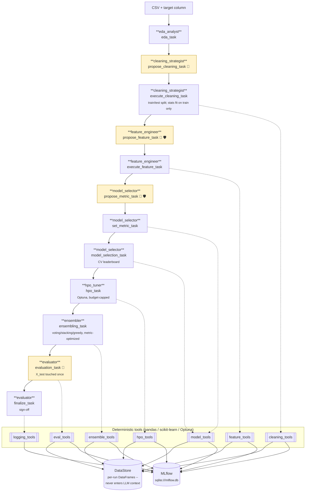

# DS-Crew

[](LICENSE)
[](pyproject.toml)
[](https://docs.crewai.com)

A [CrewAI](https://docs.crewai.com) multi-agent system that runs the full
data-science lifecycle for structured (tabular) data -- EDA, cleaning,
feature engineering, model selection, hyperparameter optimization,
evaluation, and metadata logging -- on top of deterministic, strictly-typed
Python tools instead of trusting an LLM to touch your data directly.

Raw data acquisition is explicitly out of scope: you hand it a CSV and a
target column, and it takes it from there.

## Quick start

Requires [uv](https://docs.astral.sh/uv/).

```bash
git clone https://github.com/rushikeshdhumal/ml-agent-structured-data.git
cd ml-agent-structured-data
uv sync --extra dev
cp .env.example .env   # set MODEL + the matching API key (see comments in the file)
```

Run the crew against a dataset:

```bash
uv run ds-crew --data path/to/data.csv --target target_column
```

Each invocation is one dataset, one CrewAI run, one MLflow run. By default
you'll be prompted at the console to review/edit the cleaning plan, the
feature-engineering plan, and the final model before anything irreversible
happens; set `AUTO_APPROVE=1` in `.env` to skip these gates for
automated/headless runs (every auto-approved run is tagged
`auto_approve=true` in MLflow so it's never mistaken for a real sign-off).

Inspect results:

```bash
uv run mlflow ui --backend-store-uri sqlite:///mlflow.db
```

Run the tests:

```bash
uv run pytest                    # unit tests only (default; no LLM calls)
uv run pytest -m e2e tests/e2e   # full pipeline, requires a live LLM key
```

## Architecture

Seven agents run a fixed twelve-task pipeline. Every task that touches the
dataset delegates to a deterministic tool -- the agent proposes, code
executes:



👤 = human-in-the-loop gate &nbsp;&nbsp; 🛡️ = task guardrail

**Agents never manipulate data directly.** Every mutating action --
profiling, cleaning, encoding, training, tuning, evaluating -- goes through a
Pydantic-validated tool. This is enforced in layers:

1. Pydantic `args_schema` / `output_pydantic` on every tool and "propose"
   task rejects structurally invalid output before it reaches any logic.
2. Every mutating tool re-validates its input against the *actual current
   dataset* at call time (unknown columns, target-as-feature, disallowed
   strategies all come back as a structured error, never a silent no-op).
3. Task-level `guardrail` functions (`guardrails.py`) catch business-rule
   violations (e.g. target leakage) and trigger CrewAI's automatic
   agent-retry loop.
4. The corresponding mutating tool independently re-checks the same rule --
   a guardrail only covers one task's output, so the tool call is a separate
   trust boundary that must not blindly trust upstream validation.
5. Hyperparameter search budgets (`n_trials`, `timeout_s`) are hard-capped in
   code (`settings.MAX_HPO_TRIALS` / `MAX_HPO_TIMEOUT_S`), regardless of what
   an agent requests.

**Human-in-the-loop.** Applying a cleaning plan (which also performs the
train/test split), applying a feature-engineering plan, and accepting a
final model are gated by CrewAI's native `human_input` Task flag: an agent
first *proposes* a structured plan, a human reviews/edits it at the console,
and only then does a separate *execute* task call the mutating tool with the
approved plan.

**No test-set leakage.** The train/test split happens in cleaning, not
feature engineering, specifically so that every cleaning statistic --
imputation values, outlier bounds, KNN-imputer neighbors -- is fit on the
training split only and applied identically to the test split (duplicate-row
dropping is the one exception: it runs pre-split, so an identical row can
never land in both halves). Encoders/scalers/feature-selectors in feature
engineering are fit on the training split the same way. X_test is touched
exactly once, in evaluation.

**Metadata logging** (`tools/logging_tools.py`) is deterministic code, not
an agent -- it's wired to fire automatically from inside each tool and from
`main.py`'s run lifecycle, rather than depending on an agent remembering to
log something. Everything lands in MLflow against a local SQLite-backed
tracking store, no server required.

### Model registry

`model_tools.py` cross-validates a fixed, code-defined candidate set chosen
for empirical strength on tabular data rather than breadth:

| Task | Candidates |
|---|---|
| Classification | `logistic_regression`, `knn`, `xgboost`, `lightgbm`, `catboost` |
| Regression | `ridge`, `elastic_net`, `knn`, `xgboost`, `lightgbm`, `catboost` |

The agent never chooses which model classes exist, only which leaderboard
entries move on to HPO (`hpo_tools.py`, Optuna, one fixed search space per
model) and evaluation. A failing candidate is skipped and recorded in
`Leaderboard.warnings` rather than crashing the whole leaderboard.

### Optimization metric

Before model selection, a human-gated `propose_metric_task`/`set_metric_task`
pair (`model_selector` agent) picks the metric that cross-validation, HPO,
ensembling, and evaluation all optimize against -- never hard-coded accuracy.
Allowed metrics (`model_tools.ALLOWED_METRICS`) are bounded, higher-is-better:

| Task | Allowed metrics |
|---|---|
| Classification | `f1_macro` (default), `accuracy`, `precision_macro`, `recall_macro`, `balanced_accuracy`, `roc_auc` |
| Regression | `r2` (default) |

The chosen metric is stored once on `RunState.metric_name` and threaded
through every downstream tool; `Leaderboard.metric_name` is the ground-truth
record of what a run's CV scores actually measure.

### Ensembling

After HPO, `ensemble_tools.py`'s `build_ensemble` (the `ensembler` agent)
combines the strongest leaderboard/HPO candidates (up to
`MAX_ENSEMBLE_MEMBERS`, default 5) into a single model -- soft voting,
weighted voting, greedy (Caruana 2004) selection, and stacking are all
cross-validated against the run's chosen metric, and whichever wins is kept.
Out-of-fold member predictions are computed once and reused across every
strategy, so weight/greedy search is cheap. The result is registered as an
extra `"ensemble"` leaderboard candidate, fit on `X_train` only, so it is
scored by the same single-pass `evaluate_models` call as the tuned single
models -- preserving the "X_test touched exactly once" invariant -- and is
eligible for human sign-off at finalize like any other candidate.

## Project layout

```
src/ds_crew/
  main.py           CLI entrypoint; owns the MLflow run lifecycle
  crew.py           Agent/Task/Crew wiring (tools, guardrails, output schemas, HITL flags)
  state.py          DataStore/RunState -- the actual DataFrames live here, never in LLM context
  schemas.py        Pydantic models for every plan/report passed between tasks
  guardrails.py     Function-based CrewAI Task guardrails
  settings.py       Env-driven constants (model, budgets, MLflow config, AUTO_APPROVE)
  config/
    agents.yaml     Agent role/goal/backstory
    tasks.yaml      Task descriptions, context wiring
  tools/
    eda_tools.py       Read-only profiling
    cleaning_tools.py  Missing-value/outlier/dtype cleaning
    feature_tools.py   Train/test split, encoding, scaling, feature selection
    model_tools.py     Candidate model registry, metric selection, cross-validation
    hpo_tools.py       Optuna hyperparameter search
    ensemble_tools.py  Metric-optimized voting/stacking/greedy ensembling
    eval_tools.py      Held-out evaluation
    logging_tools.py   MLflow helpers + the finalize_run tool
tests/              Unit tests for every tool/guardrail/schema (no LLM calls)
tests/e2e/          Full pipeline test; requires a live LLM key, opt-in via `-m e2e`
```

## Configuration

`.env` (copy from `.env.example`) configures:

- **LLM** -- `MODEL`, provider-agnostic via CrewAI's native provider routing
  (`gpt-4o`, `anthropic/claude-sonnet-4-5-...`, `ollama/llama3`, ...), or
  `LLM_BASE_URL` + `LLM_API_KEY` for any other OpenAI-compatible endpoint
  (e.g. NVIDIA NIM). `MAX_RPM` caps aggregate LLM calls/minute across the crew.
- **MLflow** -- `MLFLOW_TRACKING_URI`, `MLFLOW_EXPERIMENT_NAME`.
- **Guardrails/budgets** -- `AUTO_APPROVE`, `MAX_HPO_TRIALS`,
  `MAX_HPO_TIMEOUT_S`, `NEAR_PERFECT_THRESHOLD`, `RANDOM_SEED`,
  `MAX_ENSEMBLE_MEMBERS`, `ENSEMBLE_WEIGHT_TRIALS`, `MIN_ENSEMBLE_IMPROVEMENT`.

## License

[MIT](LICENSE) © 2026 Rushikesh Dhumal
