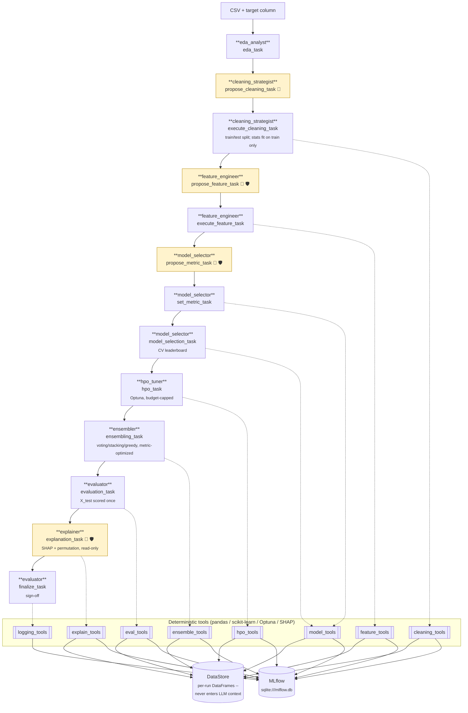

# DS-Crew

[](https://github.com/rushikeshdhumal/ml-agent-structured-data/actions/workflows/ci.yml)
[](LICENSE)
[](pyproject.toml)
[](https://docs.crewai.com)

**Letting an autonomous agent near real data is a governance problem before it
is a modeling problem.** The hard question is not whether an LLM can pick a good
model -- it usually can. It is whether you can prove what it did, stop it before
it does something irreversible, and explain the result to whoever is accountable
for the decision.

DS-Crew is one answer. It is a [CrewAI](https://docs.crewai.com) multi-agent
system that runs the full data-science lifecycle for structured (tabular) data
-- EDA, cleaning, feature engineering, model selection, hyperparameter
optimization, ensembling, evaluation, and explainability -- where **agents never
touch the data**. Every mutation goes through a deterministic, Pydantic-validated
Python tool; every irreversible decision is gated on a human; every step lands in
an audit trail.

Raw data acquisition is explicitly out of scope: you hand it a CSV and a
target column, and it takes it from there.

## Quick start

Requires [uv](https://docs.astral.sh/uv/).

```bash
git clone https://github.com/rushikeshdhumal/ml-agent-structured-data.git
cd ml-agent-structured-data
uv sync --extra dev
cp .env.example .env   # set MODEL + the matching API key (see comments in the file)
```

Run the crew against a dataset:

```bash
uv run ds-crew --data path/to/data.csv --target target_column
```

Each invocation is one dataset, one CrewAI run, one MLflow run. By default
you'll be prompted at the console to review/edit the cleaning plan, the
feature-engineering plan, the optimization metric, and the explained final
model before anything irreversible happens; set `AUTO_APPROVE=1` in `.env` to
skip these gates for automated/headless runs (every auto-approved run is tagged
`auto_approve=true` in MLflow so it's never mistaken for a real sign-off).

Inspect results:

```bash
uv run mlflow ui --backend-store-uri sqlite:///mlflow.db
```

Run the tests:

```bash
uv run pytest                    # unit tests only (default; no LLM calls)
uv run pytest -m e2e tests/e2e   # full pipeline, requires a live LLM key
```

## Walkthrough: a full interactive run

The headless path above is the CI story. The interactive path is the one worth
watching, because the four human gates are the point of the design.

### 1. Prepare the dataset

Any CSV with a target column. To exercise every stage, pick one with missing
values (cleaning does real work), mixed numeric/categorical columns (feature
engineering does real work), and mild class imbalance (the metric gate faces a
genuine decision). Columns a reader already understands help most of all --
they make the explainability output checkable against intuition rather than
taken on trust.

Drop free-text and ID-like columns first (`Name`, `Ticket`, `PassengerId`, ...).
The feature-plan schema requires *every* non-target column to be explicitly
encoded or dropped, so leaving high-cardinality text in mostly buys retries.

### 2. Configure `.env`

```bash
MODEL=z-ai/glm-5.2
LLM_BASE_URL=https://integrate.api.nvidia.com/v1
LLM_API_KEY=nvapi-...
MAX_RPM=35
AUTO_APPROVE=0        # 0 = the four human gates fire
```

### 3. Run

Must be a real interactive terminal -- the gates read stdin, so this cannot be
backgrounded or redirected to a file.

```bash
uv run ds-crew --data path/to/data.csv --target target_column --run-name my-demo
```

Optional: `--task classification|regression|auto` (default `auto`),
`--test-size 0.2`, `--metric roc_auc` (seeds the gate; a human can still
override it live).

### 4. The four gates

The run pauses at each. Press Enter to accept, or type feedback to send the
agent back:

| # | Gate | What you're reviewing |
|---|---|---|
| 1 | `propose_cleaning_task` | per-column imputation / outlier strategy |
| 2 | `propose_feature_task` | encoding + scaling per column |
| 3 | `propose_metric_task` | the metric all later stages optimize, with the agent's reasoning from EDA |
| 4 | `explanation_task` | held-out metrics **and** what the model learned -- then approve or reject |

Gate 3 is a good place to override live and watch the choice propagate through
CV, HPO, ensembling, and evaluation.

Gate 4 is the one to land on: **type an actual approval there.** Every
`AUTO_APPROVE=1` run ends `rejected` by design (the safety default when no
human is present), so a real approval is the only way to exercise the approved
branch -- `model_status=approved` plus a serialized `model/` artifact.

Budget roughly 20-25 minutes of pipeline time on top of your own review time.
(A measured headless run on a 500-row dataset took 22.1 minutes end to end with
`AUTO_APPROVE=1`, so that figure includes no human thinking time at all. Most of
it is LLM latency across 13 tasks, not local compute.)

### 5. Inspect

```bash
uv run mlflow ui --backend-store-uri sqlite:///mlflow.db
```

Walk the artifact tree at <http://localhost:5000>: `cleaning/`,
`feature_engineering/`, `hpo/`, `ensemble/`, `evaluation/`, `explanation/`,
`model/`. Every approved plan and the raw human feedback text is stored, so the
full decision trail is reconstructable after the fact.

The single most informative file is `explanation/<model>_report.json`:
`column_importance` in original column names, the model's `confident_wrong`
rows with signed per-feature contributions, and `surrogate_fidelity`.

### Two things to expect

- **Rate limits are account-wide, not per-run.** `MAX_RPM` paces calls within a
  single run and has no visibility into your previous one, so back-to-back runs
  on a free tier will 429 even with it set. Space runs 60-90s apart. NVIDIA's
  `z-ai/glm-5.2` has a history of persistent 429s; `meta/llama-3.3-70b-instruct`
  is the more reliable fallback, at the cost of weaker structured output.
- **Guardrail retries are normal.** Some models wrap structured output in prose,
  which the `propose`-stage guardrails reject; you'll see `Guardrail Failed`
  boxes that self-heal on the next attempt. A verified run hit four of these and
  still completed cleanly. This is the retry loop working, not the pipeline
  breaking.

## Architecture

Eight agents run a fixed thirteen-task pipeline. Every task that touches the
dataset delegates to a deterministic tool -- the agent proposes, code
executes:



👤 = human-in-the-loop gate &nbsp;&nbsp; 🛡️ = task guardrail

**Agents never manipulate data directly.** Every mutating action --
profiling, cleaning, encoding, training, tuning, evaluating -- goes through a
Pydantic-validated tool. This is enforced in layers:

1. Pydantic `args_schema` / `output_pydantic` on every tool and "propose"
   task rejects structurally invalid output before it reaches any logic.
2. Every mutating tool re-validates its input against the *actual current
   dataset* at call time (unknown columns, target-as-feature, disallowed
   strategies all come back as a structured error, never a silent no-op).
3. Task-level `guardrail` functions (`guardrails.py`) catch business-rule
   violations (e.g. target leakage) and trigger CrewAI's automatic
   agent-retry loop.
4. The corresponding mutating tool independently re-checks the same rule --
   a guardrail only covers one task's output, so the tool call is a separate
   trust boundary that must not blindly trust upstream validation.
5. Hyperparameter search budgets (`n_trials`, `timeout_s`) are hard-capped in
   code (`settings.MAX_HPO_TRIALS` / `MAX_HPO_TIMEOUT_S`), regardless of what
   an agent requests.

**Human-in-the-loop.** Applying a cleaning plan (which also performs the
train/test split), applying a feature-engineering plan, choosing the
optimization metric, and accepting a final model are gated by CrewAI's native
`human_input` Task flag: an agent first *proposes* a structured plan, a human
reviews/edits it at the console, and only then does a separate *execute* task
call the mutating tool with the approved plan. The final sign-off gate sits on
`explanation_task`, not `evaluation_task`, so the human decides with the
held-out metrics *and* the evidence of what the model learned in front of
them, rather than approving on a score and being shown the explanation
afterwards.

**No test-set leakage.** The train/test split happens in cleaning, not
feature engineering, specifically so that every cleaning statistic --
imputation values, outlier bounds, KNN-imputer neighbors -- is fit on the
training split only and applied identically to the test split (duplicate-row
dropping is the one exception: it runs pre-split, so an identical row can
never land in both halves). Encoders/scalers/feature-selectors in feature
engineering are fit on the training split the same way. X_test is **scored**
exactly once, in evaluation: no model can be selected, tuned, ensembled, or
compared on held-out performance more than once, so the test score cannot be
optimized against. Explanation reads X_test a second time, but read-only,
strictly after evaluation (`explain_models` refuses to run until scoring is
locked in), and only to inform the terminal human decision -- nothing it
surfaces can flow back into choosing a model.

**Metadata logging** (`tools/logging_tools.py`) is deterministic code, not
an agent -- it's wired to fire automatically from inside each tool and from
`main.py`'s run lifecycle, rather than depending on an agent remembering to
log something. Everything lands in MLflow against a local SQLite-backed
tracking store, no server required.

### Model registry

`model_tools.py` cross-validates a fixed, code-defined candidate set chosen
for empirical strength on tabular data rather than breadth:

| Task | Candidates |
|---|---|
| Classification | `logistic_regression`, `knn`, `xgboost`, `lightgbm`, `catboost` |
| Regression | `ridge`, `elastic_net`, `knn`, `xgboost`, `lightgbm`, `catboost` |

The agent never chooses which model classes exist, only which leaderboard
entries move on to HPO (`hpo_tools.py`, Optuna, one fixed search space per
model) and evaluation. A failing candidate is skipped and recorded in
`Leaderboard.warnings` rather than crashing the whole leaderboard.

### Optimization metric

Before model selection, a human-gated `propose_metric_task`/`set_metric_task`
pair (`model_selector` agent) picks the metric that cross-validation, HPO,
ensembling, and evaluation all optimize against -- never hard-coded accuracy.
Allowed metrics (`model_tools.ALLOWED_METRICS`) are bounded, higher-is-better:

| Task | Allowed metrics |
|---|---|
| Classification | `f1_macro` (default), `accuracy`, `precision_macro`, `recall_macro`, `balanced_accuracy`, `roc_auc` |
| Regression | `r2` (default) |

The chosen metric is stored once on `RunState.metric_name` and threaded
through every downstream tool; `Leaderboard.metric_name` is the ground-truth
record of what a run's CV scores actually measure.

### Ensembling

After HPO, `ensemble_tools.py`'s `build_ensemble` (the `ensembler` agent)
combines the strongest leaderboard/HPO candidates (up to
`MAX_ENSEMBLE_MEMBERS`, default 5) into a single model -- soft voting,
weighted voting, greedy (Caruana 2004) selection, and stacking are all
cross-validated against the run's chosen metric, and whichever wins is kept.
Out-of-fold member predictions are computed once and reused across every
strategy, so weight/greedy search is cheap. The result is registered as an
extra `"ensemble"` leaderboard candidate, fit on `X_train` only, so it is
scored by the same single-pass `evaluate_models` call as the tuned single
models -- preserving the "X_test touched exactly once" invariant -- and is
eligible for human sign-off at finalize like any other candidate.

### Explainability

After evaluation and before sign-off, `explain_tools.py`'s `explain_models`
(the `explainer` agent) reports what the evaluated model(s) actually learned:

| Layer | Method | Applies to |
|---|---|---|
| Floor (always) | scikit-learn permutation importance on held-out rows | every model, **including the ensemble** |
| Attribution | SHAP `TreeExplainer` | `xgboost`, `lightgbm`, `catboost` (binary only) |
| Attribution | SHAP `LinearExplainer` | `logistic_regression`, `ridge`, `elastic_net` |

Permutation importance is the floor because it is the only method that works
uniformly across the whole registry *and* the `VotingClassifier`/
`StackingClassifier` the ensembler builds -- those expose neither
`feature_importances_` nor `coef_`, so the ensemble previously reached the
sign-off gate with no attribution data at all despite frequently being the
recommended model. Every SHAP call degrades to permutation-only with a
recorded warning rather than failing the stage.

Each report carries importance **rolled up to the original dataset columns**
(one-hot slices recombined into the column a human actually reasons about),
signed per-row attributions for the model's most confident correct answers,
most confident *mistakes*, and most uncertain cases, a shallow surrogate
decision tree with a fidelity score saying whether those simple rules can be
trusted as a description of the model, and the list of engineered features
that contributed nothing. Reports land in MLflow under `explanation/`.

Two implementation notes worth knowing before touching this stage: SHAP is
skipped outright for **multiclass CatBoost** (shap 0.52.0's `TreeExplainer`
segfaults there -- a process kill no `try/except` can recover from, so it must
be a pre-emptive guard), and every SHAP import/call runs inside
`_unpatched_warnings()` because CrewAI monkey-patches `warnings.warn` with a
wrapper that rejects Python 3.12's `skip_file_prefixes`, which matplotlib
passes during shap's import chain.

## Project layout

```
src/ds_crew/
  main.py           CLI entrypoint; owns the MLflow run lifecycle
  crew.py           Agent/Task/Crew wiring (tools, guardrails, output schemas, HITL flags)
  state.py          DataStore/RunState -- the actual DataFrames live here, never in LLM context
  schemas.py        Pydantic models for every plan/report passed between tasks
  guardrails.py     Function-based CrewAI Task guardrails
  settings.py       Env-driven constants (model, budgets, MLflow config, AUTO_APPROVE)
  usage_listener.py Per-task/per-agent token + retry accounting off CrewAI's event bus
  config/
    agents.yaml     Agent role/goal/backstory
    tasks.yaml      Task descriptions, context wiring
  tools/
    eda_tools.py       Read-only profiling
    cleaning_tools.py  Missing-value/outlier/dtype cleaning
    feature_tools.py   Train/test split, encoding, scaling, feature selection
    model_tools.py     Candidate model registry, metric selection, cross-validation
    hpo_tools.py       Optuna hyperparameter search
    ensemble_tools.py  Metric-optimized voting/stacking/greedy ensembling
    eval_tools.py      Held-out evaluation
    explain_tools.py   SHAP + permutation attributions, surrogate, local examples
    logging_tools.py   MLflow helpers + the finalize_run tool
  service/          Optional HTTP surface over the tool layer (see below)
    app.py            FastAPI app; routes generated from the tool registry
    registry.py       Which tools are published, read off the tool classes
    __main__.py       `ds-crew-service` entrypoint
docs/
  model-selection.md  Measured per-agent cost + which model each agent should run
tests/              Unit tests for every tool/guardrail/schema (no LLM calls)
tests/e2e/          Full pipeline test; requires a live LLM key, opt-in via `-m e2e`
```

## Configuration

`.env` (copy from `.env.example`) configures:

- **LLM** -- `MODEL`, provider-agnostic via CrewAI's native provider routing
  (`gpt-4o`, `anthropic/claude-sonnet-4-5-...`, `ollama/llama3`, ...), or
  `LLM_BASE_URL` + `LLM_API_KEY` for any other OpenAI-compatible endpoint
  (e.g. NVIDIA NIM), or `AZURE_FOUNDRY_ENDPOINT` + `AZURE_FOUNDRY_API_KEY` for
  Azure AI Foundry (see below). `MAX_RPM` caps aggregate LLM calls/minute
  across the crew.
- **MLflow** -- `MLFLOW_TRACKING_URI`, `MLFLOW_EXPERIMENT_NAME`.
- **Guardrails/budgets** -- `AUTO_APPROVE`, `MAX_HPO_TRIALS`,
  `MAX_HPO_TIMEOUT_S`, `NEAR_PERFECT_THRESHOLD`, `RANDOM_SEED`,
  `MAX_ENSEMBLE_MEMBERS`, `ENSEMBLE_WEIGHT_TRIALS`, `MIN_ENSEMBLE_IMPROVEMENT`.
- **Explainability** -- `EXPLAIN_MAX_ROWS`, `EXPLAIN_PERMUTATION_REPEATS`,
  `EXPLAIN_TOP_K_FEATURES`, `EXPLAIN_LOCAL_EXAMPLES`,
  `EXPLAIN_SURROGATE_MAX_DEPTH`.

### Running against Azure AI Foundry

Foundry exposes an OpenAI-compatible `/openai/v1` surface, so the crew targets it
through the same native provider it already uses for NVIDIA NIM. **No extra
dependency is required**: neither `crewai[azure-ai-inference]` nor
`crewai[litellm]`.

```dotenv
MODEL=gpt-4o-ds-crew
AZURE_FOUNDRY_ENDPOINT=https://my-resource.openai.azure.com
AZURE_FOUNDRY_API_KEY=...
```

Paste the endpoint in whatever form the portal shows it (bare, or suffixed with
`/models`, `/openai`, or `/openai/v1`); `crew.foundry_base_url` normalizes all of
them. `AZURE_FOUNDRY_ENDPOINT` takes precedence over `LLM_BASE_URL`, and a missing
key fails at crew-build time rather than as a 401 partway through a paid run.

> **`MODEL` means different things per Foundry flavour**, and this is the usual
> misconfiguration. For an **Azure OpenAI** deployment it is the *deployment name*
> you chose, not the model name. For **Foundry Models** it is the catalog model
> name (e.g. `Llama-3.3-70B-Instruct`).

Every run tags MLflow with `llm_provider` (`native` / `custom_openai` /
`azure_foundry`) and `model`, so token counts and `estimated_cost_usd` stay
attributable when comparing providers.

Only the version-less `/openai/v1` surface is supported. If you need the legacy
`?api-version=` surface, set `LLM_BASE_URL` directly instead.

> **numpy is capped below 2.5** in `pyproject.toml`. That bound comes from
> `shap` -> `numba`, not from anything this project uses directly; numba 0.66.0
> (the latest) requires `numpy<2.5`. Lift it only once numba ships numpy 2.5
> support.

## HTTP tool service

The tool layer can also be served over HTTP, so callers outside this process (an
Azure AI Foundry agent, or a second orchestrator) can invoke the same
Pydantic-validated tools.

```bash
uv sync --extra service
SERVICE_API_KEY=$(python -c "import secrets; print(secrets.token_urlsafe(32))") \
  uv run ds-crew-service --port 8000
```

Routes are **generated from the tool classes**, so the OpenAPI document at
`/openapi.json` (the artifact a Foundry agent registers against) carries each
tool's real argument schema and cannot drift from what the in-process
orchestrator validates. Publishing a new tool means adding it to
`service/registry.py` and nothing else.

```
POST   /runs                              create a run -> {run_id, run_token}
GET    /runs/{run_id}                     stage flags + history
DELETE /runs/{run_id}                     drop the run, revoke its token
POST   /runs/{run_id}/tools/{tool_name}   invoke one tool
```

**The in-process orchestrator does not go through this.** `ds-crew` keeps calling
tools in-process exactly as before, so the service adds no regression risk to the
path that already works.

### Authorization

In-process, `run_id` is bound into each tool's constructor and never exposed as an
LLM-callable argument, so a hallucinating or prompt-injected agent cannot address
another run's data. Over HTTP `run_id` is necessarily part of the request, and a
single shared key would let any authenticated caller reach any run, strictly
weaker than what it replaces.

So creating a run mints a **per-run token**, returned once. `SERVICE_API_KEY` gates
run *creation*; the run token gates everything that touches a run's data. An agent
handed run A's token cannot reach run B even if it invents B's id, and gets a 404
rather than a 403 so the status code does not confirm B exists.

Ordering stays a tool-level concern: calling `explain_models` before
`evaluate_models` returns the same `{"error": ...}` payload an in-process agent
would see, with a 200. An out-of-order call is a decision the tool makes, not an
HTTP failure.

### Single replica, for now

`RunState` holds DataFrames and fitted models in the serving process's memory, and
run tokens live alongside them, so the service runs **one worker** and does not
scale horizontally. Scaling out means externalizing that state, and the
`X_test`-scored-exactly-once invariant along with it, which is the part that needs
real care rather than a storage swap.

## Cost and model selection

An agentic system's running cost is LLM spend, so this repo measures it rather
than estimating it. Every run records token counts, request count and wall-clock
to MLflow, plus an optional `estimated_cost_usd` when `LLM_PRICE_PER_1M_INPUT` /
`_OUTPUT` are set. `usage_listener.py` additionally attributes **every LLM call
to the task and agent that made it**, which is what makes per-agent model choice
a measurement instead of an opinion.

One measured run on a 500-row/5-column dataset, priced against Azure `gpt-5`
rates in `eastus2`:

| | |
|---|---|
| Tokens | 65,664 prompt + 38,645 completion, 29 requests, 8.5 min |
| All agents on gpt-5 | $0.9371/run |
| **Tiered assignment** | **$0.2583/run** (-72%) |

Two results drive that tiering, and both cut against intuition:

- **The `explainer` alone is 38% of the all-gpt-5 bill**, because output tokens
  cost 8x input and it emits the most prose. It also has the *strongest* safety
  net: a grounding guardrail plus a human gate.
- **`evaluation_task` has no guardrail and no human gate**, yet the evaluator is
  the agent responsible for flagging leakage. It is the thinnest safety net in
  the pipeline, so it gets the strongest model regardless of its modest cost
  share.

Spend follows exposure rather than job title. Full per-agent numbers, the
safety-net map, the recommended assignment and its caveats are in
[docs/model-selection.md](docs/model-selection.md).

## Limitations

Stated plainly, because knowing where a system stops is part of operating it.

- **Regression optimizes `r2` only.** Deliberate, not an oversight: HPO hardcodes
  `direction="maximize"` and the near-perfect leakage heuristic assumes a bounded
  0-1 metric, so an unbounded lower-is-better error metric like RMSE would break
  both silently. Adding one means addressing those two assumptions first.
- **CSV in, one dataset per run.** Data acquisition, joins, and warehouse
  connectivity are all out of scope by design.
- **Single-process.** `DataStore` holds the DataFrames for a run in memory in one
  process. That is fine for a CLI invocation and is *not* yet suitable for
  distributed, multi-worker, or serverless execution. The HTTP tool service
  inherits this: it runs one worker, and scaling it out requires externalizing
  run state together with the `X_test`-scored-exactly-once invariant, which
  becomes a concurrency problem rather than a storage one.
- **Human gates block on stdin.** Interactive runs need a real terminal; they
  cannot be backgrounded or piped. Headless automation must use `AUTO_APPROVE=1`,
  which by design always finalizes as `rejected` since no human actually approved.
- **The pipeline ends at a signed-off model.** No serving, no monitoring, no
  drift detection, no scheduled retraining.
- **SHAP is skipped for multiclass CatBoost.** Upstream `TreeExplainer` segfaults
  there, so it is guarded pre-emptively and that model falls back to permutation
  importance. Binary CatBoost is unaffected.
- **Python 3.12 or 3.13 only.** The floor is set by `shap`: version 0.52.0, the
  release the explainability layer's output-shape handling is verified against,
  itself requires >=3.12. Older Pythons silently resolve to older `shap`
  (3.11 gets 0.51.0, 3.10 gets 0.49.1) whose `TreeExplainer` return shapes
  differ, so supporting them would mean shipping explainability against
  untested versions. Python 3.10 additionally cannot install at all --
  `crewai -> chromadb -> onnxruntime` has no cp310 wheel above 1.23.x.
  One platform exception remains: **Intel macOS** (`darwin`/`x86_64`) resolves
  `shap` 0.49.1 regardless of Python version, because shap caps `numba<0.63`
  there. CI does not cover that platform, so explainability on Intel Macs is
  unverified; Apple Silicon, Linux and Windows all get 0.52.0.
- **`numpy` is pinned `<2.5`**, inherited from `shap -> numba`. Not a constraint
  this project needs directly; see the note under Configuration.
- **LLM cost is not yet a first-class budget.** Trial counts, ensemble members and
  explanation rows are all hard-capped in code, but token spend is recorded rather
  than capped.

## License

[MIT](LICENSE) © 2026 Rushikesh Dhumal
