# DS-Crew

**Letting an autonomous agent near real data is a governance problem before
it is a modeling problem.** Whether an LLM can pick a good model is rarely
the hard question. Whether you can prove what it did, stop it before it does
something irreversible, and explain the result to whoever is accountable
for the decision — that's the one that matters.

DS-Crew answers it by hosting eight specialized agents in **Azure AI
Foundry** and letting them run the full data-science lifecycle end to end —
but never letting them touch data directly, and never letting an
irreversible action happen without a human seeing it first.

## The pipeline

Give it a CSV and a target column. Eight agents run a fixed sequence — the
order is enforced in code, not left to the agents to negotiate, because this
pipeline has hard invariants (you cannot tune a model before you've cleaned
the data) that an AI-improvised order could violate.

```mermaid
flowchart TD
    EDA["eda<br/><sub>eda-analyst</sub>"]
    CLEAN["cleaning 👤<br/><sub>cleaning-strategist</sub>"]
    FEAT["features 👤<br/><sub>feature-engineer</sub>"]
    SEL["model_selection 👤<br/><sub>model-selector</sub>"]
    HPO["hpo<br/><sub>hpo-tuner</sub>"]
    ENS["ensemble<br/><sub>ensembler</sub>"]
    EVAL["evaluation<br/><sub>evaluator</sub>"]
    EXP["explanation<br/><sub>explainer</sub>"]
    CHECK["grounding_check<br/><sub>automated safety check, not an agent</sub>"]
    VERDICT["human_verdict 👤<br/><sub>review the evidence, decide</sub>"]
    FIN["finalize 👤<br/><sub>evaluator records the decision</sub>"]

    EDA --> CLEAN --> FEAT --> SEL --> HPO --> ENS --> EVAL --> EXP --> CHECK --> VERDICT --> FIN

    classDef gate fill:#123456,stroke:#000000
    class CLEAN,FEAT,SEL,VERDICT,FIN gate
```

👤 = a human reviews the exact proposal and approves, rejects, or sends it
back for revision before anything executes.

At every stage, **the agent proposes; deterministic code executes.** Every
mutating action — cleaning, encoding, training, tuning — goes through a
validated Python tool, re-checked against the actual dataset at call time.
The agent's job is to decide *what* to do; it is structurally incapable of
doing it wrong in a way that reaches real data unvalidated.

## Why this is defensible, not just automated

- **Five human checkpoints, not four.** The cleaning plan, the feature plan,
  and the optimization metric are gated proposals. The fifth — final model
  sign-off — is a *separate* decision made only after the human has seen the
  held-out score *and* the explanation of what the model actually learned,
  never one without the other.
- **The test set is scored exactly once, structurally.** No model can be
  selected, tuned, or ensembled based on held-out performance more than
  once — the score cannot be optimized against, by the agents or a human.
- **Every run is checked automatically before a human sees it**, free —
  flags likely data leakage and any explanation that references a model that
  was never actually evaluated. A second, deeper check is available on
  demand: three LLM judges (groundedness, task adherence, tool-call
  accuracy) that upload real, independently-auditable scores to Azure's own
  Evaluation UI — not something this project could quietly grade itself on.
- **Two independent records of what happened.** Every agent call's latency,
  cost, and exact model version is traced to Application Insights; every
  human decision (who approved what, when) is logged to MLflow. Neither
  depends on the other being right.
- **The system watches its own dependencies.** It can report on demand which
  deployed models are approaching end-of-life and what to migrate to —
  built after a live incident where a model silently retired mid-project.

## What it costs, and where it runs

Roughly **$0.26 per run** in measured LLM spend (not estimated) on a
demo-sized dataset — driven down 72% from a flat-rate baseline by giving the
most capable model to the one agent with no other safety net (the evaluator,
the last line of defense against reporting a leaky model as good) and
cheaper models to lower-stakes stages. The actual model training runs on
local hardware at zero additional Azure cost; hosting that compute in Azure
was priced out and shelved, since an always-on container costs more per
month than hundreds of runs' worth of LLM spend.

## The full technical picture

Setup instructions, the tool-service API, every configuration flag, and the
reasoning behind every architectural decision above are in
**[docs/ENGINEERING.md](docs/ENGINEERING.md)**.

## License

[MIT](LICENSE) © 2026 Rushikesh Dhumal
