# DS-Crew

**Letting an autonomous agent near real data is a governance problem before
it is a modeling problem.** Whether an LLM can pick a good model is rarely
the hard question. Whether you can prove what it did, stop it before it does
something irreversible, and explain the result to whoever is accountable for
the decision — that's the one that matters.

DS-Crew answers it with eight specialized agents that run the full
data-science lifecycle — profiling, cleaning, feature engineering, model
selection, tuning, ensembling, evaluation, explanation — but never touch
data directly, and never take an irreversible action without a human seeing
it first. Hand it a CSV and a target column; it takes it from there.

## Two implementations, one design

This project exists in two working forms, built in sequence — the second
proving the same architecture on governed cloud infrastructure rather than
replacing it:

| | `main` (this branch) | `feat/maf-workflow` |
|---|---|---|
| Agents run on | [CrewAI](https://docs.crewai.com), in-process, any OpenAI-compatible model | Azure AI Foundry — governed, traced, content-filtered agent hosting |
| Orchestration | CrewAI's `Process.sequential` | Microsoft Agent Framework, driving the identical pipeline order from code |
| Requires | Nothing but an LLM API key | An Azure subscription |
| Adds over `main` | — | RBAC-scoped access, Application Insights traces, on-demand LLM-judged evaluation uploaded to Foundry's own audit UI, automatic model-deprecation monitoring |

Same eight agents, same tools, same gates, same no-leakage guarantee, in
both. `main` is the fastest path to watching the architecture work with
nothing but an API key; `feat/maf-workflow` is the same design built for a
real, governed deployment.

## The pipeline (this branch)

Thirteen tasks across eight agents, in a fixed order — enforced by CrewAI's
`Process.sequential`, not left to the agents to negotiate, because this
pipeline has hard invariants (you cannot tune a model before you've cleaned
the data) that an AI-improvised order could violate.

```mermaid
flowchart TD
    EDA["eda_task<br/><sub>eda_analyst</sub>"]
    PC["propose_cleaning_task 👤<br/><sub>cleaning_strategist</sub>"]
    EC["execute_cleaning_task<br/><sub>cleaning_strategist</sub>"]
    PF["propose_feature_task 👤<br/><sub>feature_engineer</sub>"]
    EF["execute_feature_task<br/><sub>feature_engineer</sub>"]
    PM["propose_metric_task 👤<br/><sub>model_selector</sub>"]
    SM["set_metric_task<br/><sub>model_selector</sub>"]
    MS["model_selection_task<br/><sub>model_selector</sub>"]
    HPO["hpo_task<br/><sub>hpo_tuner</sub>"]
    ENS["ensembling_task<br/><sub>ensembler</sub>"]
    EV["evaluation_task<br/><sub>evaluator</sub>"]
    EX["explanation_task 👤<br/><sub>explainer -- approve or reject here</sub>"]
    FIN["finalize_task<br/><sub>evaluator records the decision</sub>"]

    EDA --> PC --> EC --> PF --> EF --> PM --> SM --> MS --> HPO --> ENS --> EV --> EX --> FIN

    classDef gate fill:#123456,stroke:#ffffff
    class PC,PF,PM,EX gate
```

👤 = a human reviews the exact proposal — approve, edit, or send it back —
before anything executes.

At every stage, **the agent proposes; deterministic code executes.** Every
mutating action — cleaning, encoding, training, tuning — goes through a
validated Python tool, re-checked against the actual dataset at call time.
The agent decides *what* to do; it is structurally incapable of making that
decision take effect unvalidated.

## Why this is defensible, not just automated

- **Four human checkpoints.** The cleaning plan, the feature plan, and the
  optimization metric are gated proposals a human reviews before they're
  applied. The fourth is the one that matters most: final model sign-off,
  made with the held-out score *and* the evidence of what the model actually
  learned in front of the reviewer, never one without the other.
- **The test set is scored exactly once, structurally.** No model can be
  selected, tuned, or ensembled based on held-out performance more than
  once — the score cannot be optimized against, by the agents or a human.
- **Five automated guardrails run before a human ever sees a proposal** —
  target leakage, target modification, metric-choice validity, whether the
  final explanation references a model that was never actually evaluated,
  and whether the decision was actually recorded. Each is independently
  re-checked by the tool layer too, so a guardrail bypass alone can't reach
  real data.
- **Every decision is reconstructable.** Every approved plan, and the literal
  text of any human feedback that sent an agent back to revise, is stored in
  MLflow — not just the final answer, the full negotiation.

## The full technical picture

Setup instructions, the full interactive walkthrough, configuration, and the
reasoning behind every architectural decision above are in
**[docs/ENGINEERING.md](docs/ENGINEERING.md)**. The Azure AI Foundry
implementation has its own README on the `feat/maf-workflow` branch.

## License

[MIT](LICENSE) © 2026 Rushikesh Dhumal
